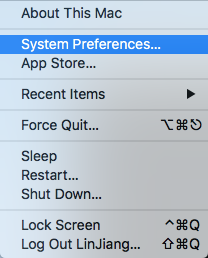
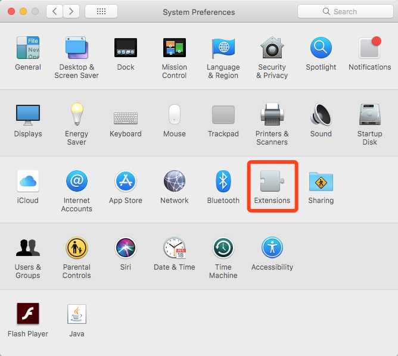
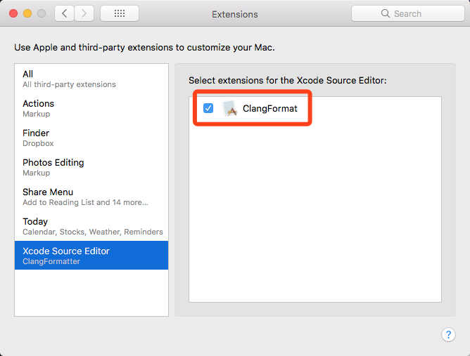
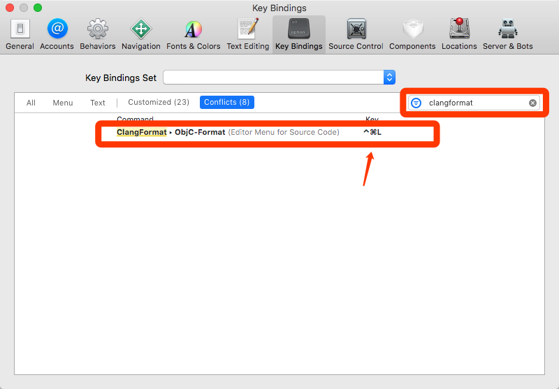
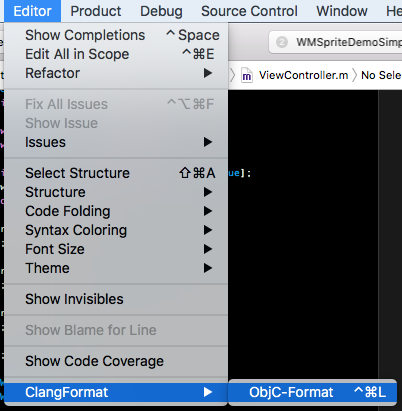

Clang Format Code-Style-Format
===================================================

A code style-format tool for Xcode Source Editor Extension. 

You can create your own (or team) code style configuration.

[Learn from here][2]

**Objective-C(only)**


Requirement
-----------

- OS X 10.12 or higher
- Xcode 9.x+


Install
-------

1. Download `ClangFormatter.app` [here][3]
2. Copy and Open `ClangFormatter.app` to `/Applications` Folder.
3. Run it then close it.

*Uninstall*

Delete `ClangFormatter.app` from `/Applications`


Usage
-----

### 1. Enable ClangFormat
Check <kbd>System Preferences</kbd> -> <kbd>Extensions</kbd> -> <kbd>Xocde Source Editor</kbd> -> <kbd>ClangFormat</kbd>








Start(or _restart_) The Xcode.


### 2. Setting Shortcut in Xcode 
<kbd>Preferences</kbd> -> <kbd>Key bindings</kbd> -> <kbd>Filter: clangformat</kbd>



### 3. Use Menu (or _key bindings_) to format your `Objective-C` file. (Xcode)

<kbd>Editor</kbd> -> <kbd>ClangFormat</kbd> -> <kbd>ObjC-Format</kbd>




Custom Your Own Style
---------------------

Change options of the `_clang-format-objc` file.

[See ClangFormat-Option][2]

### Update Your config file.


__Step 1,2 is Optional__

+ First, Move to your config file(`_clang-format-objc`) Folder.

_In Project:_

`cd ClangFormat/style-config/`
    
+ Copy the config file to the format app.

```bash
cp -f ./_clang-format-objc /Applications/ClangFormatter.app/Contents/PlugIns/ClangFormat.appex/Contents/Resources/_clang-format-objc
```


TODO List
---------

1. Modify the config file(`_clang-format-objc`) of the user interface

2. Other clang-style config file:
    - C/C++
    - Java
    - JavaScript

Reference
---------

- Fork from [ClangFormatter](https://github.com/BalestraPatrick/ClangFormatter)
- [Swift](https://swift.org/documentation/)
- [Creating a Source Editor Extension(Apple)](https://developer.apple.com/documentation/xcodekit/creating_a_source_editor_extension)
- [Create an Xcode Source Editor Extension](https://code.tutsplus.com/tutorials/how-to-create-an-xcode-source-editor-extension--cms-26772)
- [ClangFormat][1]

License
-------

__MIT__

[1]:https://clang.llvm.org/docs/ClangFormat.html
[2]:https://clang.llvm.org/docs/ClangFormatStyleOptions.html
[3]:Package/ClangFormatter.app
